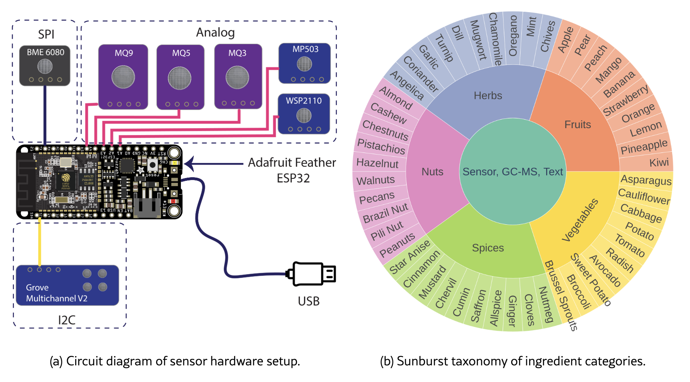
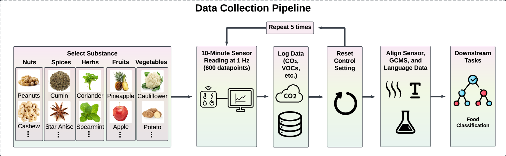

# SmellNet: A Large-scale Dataset for Real-world Smell Recognition

SmellNet is the first large-scale open-source dataset that captures how real-world substances smell, digitized using portable gas and chemical sensors. It includes 50 hours of data from 50 substances (nuts, spices, herbs, fruits, and vegetables), totaling over 180,000 time steps of multichannel sensor data, accompanied by chemical composition (GC-MS) and textual descriptions.

SmellNet enables research into:

- 🧠 Real-time substance classification with supervised learning

- 🔁 Cross-modal learning with sensor + GC-MS alignment

- 📈 Time-series modeling using LSTMs and Transformers

- 📊 Signal preprocessing like first-order temporal difference (FOTD)

## 📂 Dataset Access

The full dataset is hosted on Hugging Face:
👉 [SmellNet on Hugging Face](https://huggingface.co/datasets/DeweiFeng/smell-net/tree/main)

Each ingredient has multiple time-series recordings in CSV format, plus paired metadata and chemical information to support multimodal learning tasks.

SmellNet is the first large-scale database that digitizes a diverse range of smells in the natural world. SmellNet enables various AI models to make substance prediction like supervised learning, contrastive learning and more to explore!

## 🧪 Applications

SmellNet is designed to support machine learning for:

- Allergen detection (e.g., peanut traces)

- Food and beverage quality control

- Digital olfaction and human-AI interaction

- Health diagnostics (e.g., stress, hormones, early disease)

## 🔗 Resources
- [Paper](https://arxiv.org/abs/2506.00239v1)

## 📂 Folder Structure
- `offline_training`: Contains folders of smell data (CSV) for training; each folder represents a substance.
- `offline_testing`: Contains folders of smell data (CSV) for testing; each folder represents a substance.
- `online_nuts`: Contains smell data (CSV) of nuts for testing; data collected from a different timeframe than offline data.
- `online_spices`: Contains smell data (CSV) of spices for testing; data collected from a different timeframe than offline data.
- `text_description.json`: Text descriptions of all substances, generated by a large language model.
- `gcms_dataframe.csv`: High-resolution GC-MS data paired with each substance.