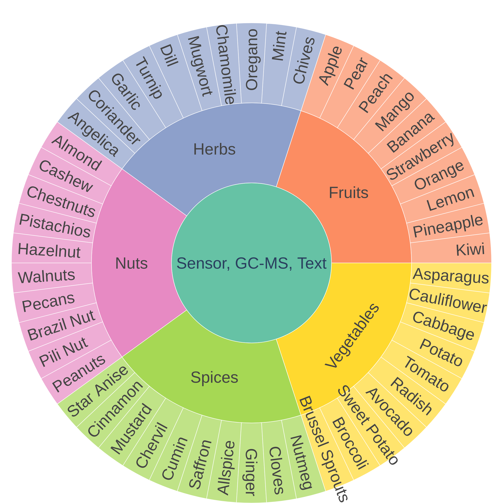
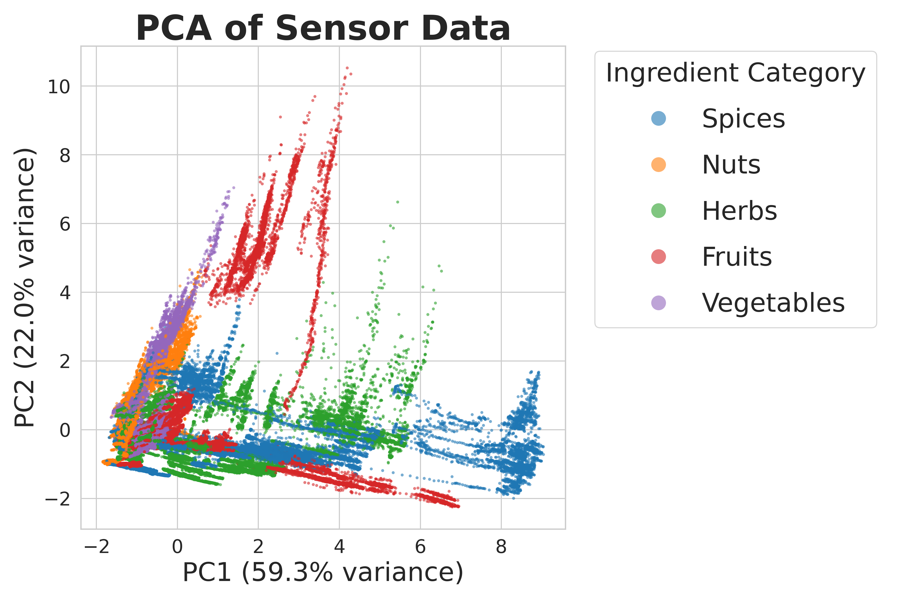

# SmellNet

**SmellNet** is a comparatively large, open dataset for **sensor-based machine olfaction**: real-world smell measurements from a compact array of low-cost **metal-oxide (MOX)** gas sensors. The [ICLR 2026](#paper-and-citation) paper describes about **828,000** time-series readings across **50** base substances (nuts, spices, herbs, fruits, and vegetables) and **43** mixtures with **fixed ingredient volumetric ratios**, spanning about **68 hours** of controlled acquisition, with **GC–MS** priors and **text metadata** aligned to substances.

The benchmark supports substance **classification** (six sensor channels on the base task), **mixture distribution prediction** (four Grove channels in the paper’s mixture setup), cross-modal sensor–chemistry alignment, and temporal modeling (including first-order differencing and sliding windows). The paper introduces **ScentFormer**, a Transformer-based architecture combining temporal differencing and sliding-window augmentation. Reported results include **63.3%** Top-1 accuracy on **SmellNet-Base** with GC–MS supervision, and **50.2%** Top-1@0.1 on the **test-seen** split of **SmellNet-Mixture**.

<p align="center">
  
  
</p>

---

## Dataset access

The released dataset is on Hugging Face:

**[SmellNet on Hugging Face](https://huggingface.co/datasets/DeweiFeng/smell-net/tree/main)**

The paper links the companion code repository as **[github.com/MIT-MI/SmellNet](https://github.com/MIT-MI/SmellNet)** (use whichever fork you are cloning from for issues and PRs).

Each substance has one or more CSV time series; metadata and chemical tables support multimodal and contrastive setups.

---

## Repository layout

| Path | Description |
|------|-------------|
| `models/` | Training and evaluation code: `run.py` (classification / contrastive), `run_mixture.py` (mixture), `train.py`, `dataset.py`, `load_data.py`, `analyze_runs.py`, etc. **Run commands from this directory** (or use `scripts/run_experiments.sh`, which `cd`s here). |
| `scripts/` | One-off utilities and example shell sweeps: `create_iclr_data.py`, `encode_text_description.py`, figure regeneration scripts, `run_experiment.bash`, `run_analysis.bash`, `run_experiments.sh`. |
| `analysis/` | Notebooks and standalone analysis scripts (outputs often go to `data_stats/`). |
| `gcms_analysis/` | GC–MS processing scripts and figures; processed tensors live under `gcms_analysis/gcms_processed/` (gitignored; build locally or fetch from Hugging Face). |
| `data_collection/` | Serial acquisition helpers used with the Arduino stack. |
| `preprocessing/` | Legacy path cleanup and raw-to-folder utilities (paths are relative to the repo root). |
| `data_stats/` | Summary plots and tables produced by analysis (checked in for the paper where applicable). |
| `figures/paper/` | Default output location for regenerated bar charts (e.g. from `scripts/regenerate_smellnet_all_graphs.py`). |
| `Arduino/` | Sensor libraries and firmware used during data collection. |
| `data/` | Full per-substance sensor CSV trees after you download or unpack the dataset (gitignored at repo root). |
| `ICLR_data/` | Curated six-channel trees matching the paper’s `run.py` defaults (gitignored; build with `scripts/create_iclr_data.py` or download from Hugging Face). |
| `gcms_data/` | Raw FooDB / GC–MS inputs for `gcms_analysis/` pipelines (gitignored). |

**Data note:** Large CSVs, embeddings, zip drops, and run logs are listed in `.gitignore`. After cloning, download the SmellNet assets from Hugging Face (see above) and place them under `data/`, `ICLR_data/`, and `gcms_analysis/` as described in the dataset card.

**Historical note:** Older notebooks may mention `offline_training`, `offline_testing`, or `smell-net` paths; equivalent trees in this repo are under `data/` and `ICLR_data/`. Pass the directories you have on disk into the CLI flags.

---

## Running experiments

Training entrypoints live under `models/`. Paths are passed explicitly (there is no single hard-coded data root).

**Classification / contrastive (SmellNet-Base-style):** after installing [dependencies](#dependencies):

```bash
cd models
python run.py \
  --train-dir ../ICLR_data/training \
  --test-dir ../ICLR_data/testing \
  --real-test-dir ../ICLR_data/testing \
  --gcms-csv ../gcms_analysis/gcms_food_vectors.csv \
  --models transformer \
  --epochs 90 --batch-size 32 --lr 0.001
```

See `scripts/run_experiment.bash` for a fuller sweep (models, windows, contrastive mode, gradients). For mixture experiments, use `models/run_mixture.py` and the commented template at the bottom of `scripts/run_experiment.bash`.

`scripts/run_experiments.sh` is a thin wrapper that `cd`s into `models/` and runs `python run.py` with whatever arguments you pass (paths are relative to `models/`, e.g. `./scripts/run_experiments.sh --train-dir ../ICLR_data/training --help`).

---

## Dependencies

There is no pinned `requirements.txt` in this repository. The `models/` code expects **PyTorch**, **pandas**, **NumPy**, and **scikit-learn**; plotting utilities use **matplotlib**. Check imports in `models/run.py`, `models/load_data.py`, and `models/run_mixture.py` for the exact set. Use **Python 3.10+** unless you verify an older interpreter for your setup.

---

## Applications

Illustrative downstream areas include allergen-relevant sensing, food and beverage QC, digital olfaction interfaces, and research-oriented health and environmental sensing (always subject to validation and regulation outside controlled studies).

---

## Paper and citation

The work appears as a **conference paper at ICLR 2026**:

**SmellNet: A Large-Scale Dataset for Real-World Smell Recognition**  
Dewei Feng, Wei Dai, Carol Li, Alistair Pernigo, Paul Pu Liang — MIT Media Lab and MIT EECS.

An extended preprint is also on arXiv as **[2506.00239](https://arxiv.org/abs/2506.00239)** (author list and wording may differ slightly from the proceedings version).

If you use SmellNet or this code, please cite the ICLR paper. Example BibTeX (fill in `url` / `pages` from OpenReview or the official proceedings when you have them):

```bibtex
@inproceedings{feng2026smellnet,
  title={{SmellNet}: A Large-Scale Dataset for Real-World Smell Recognition},
  author={Feng, Dewei and Dai, Wei and Li, Carol and Pernigo, Alistair and Liang, Paul Pu},
  booktitle={International Conference on Learning Representations (ICLR)},
  year={2026},
}
```

Optional arXiv record (may not match proceedings metadata exactly):

```bibtex
@misc{feng2025smellnetarxiv,
  title={{SmellNet}: A Large-scale Dataset for Real-world Smell Recognition},
  author={Feng, Dewei and Dai, Wei and Li, Carol and Pernigo, Alistair and Wen, Yunge and Liang, Paul Pu},
  year={2025},
  eprint={2506.00239},
  archivePrefix={arXiv},
  primaryClass={cs.AI},
  url={https://arxiv.org/abs/2506.00239},
}
```

---

## License

Add or link your code and data licenses here if they are not already in the repository root.
