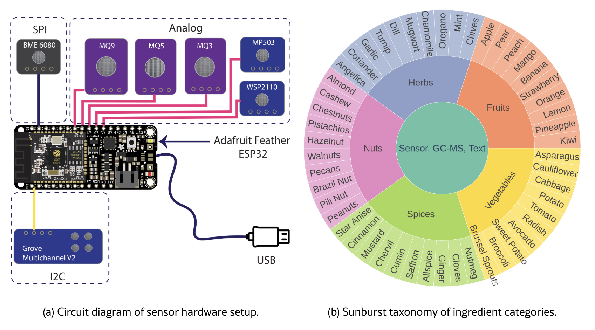
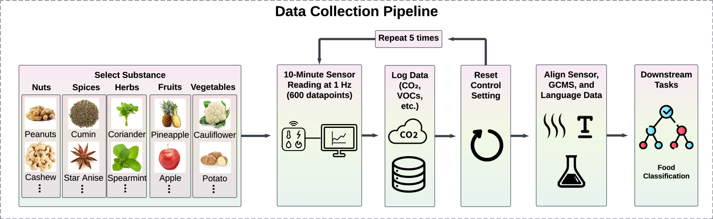

# SmellNet

**SmellNet** is a comparatively large, open dataset for **sensor-based machine olfaction**: real-world smell measurements from a compact array of low-cost **metal-oxide (MOX)** gas sensors. The [ICLR 2026](#paper-and-citation) paper describes about **828,000** time-series readings across **50** base substances (nuts, spices, herbs, fruits, and vegetables) and **43** mixtures with **fixed ingredient volumetric ratios**, spanning about **68 hours** of controlled acquisition, with **GC–MS** priors and **text metadata** aligned to substances.

The benchmark supports substance **classification** (six sensor channels on the base task), **mixture distribution prediction** (four Grove channels in the paper’s mixture setup), cross-modal sensor–chemistry alignment, and temporal modeling (including first-order differencing and sliding windows). The paper introduces **ScentFormer**, a Transformer-based architecture combining temporal differencing and sliding-window augmentation. Reported results include **63.3%** Top-1 accuracy on **SmellNet-Base** with GC–MS supervision, and **50.2%** Top-1@0.1 on the **test-seen** split of **SmellNet-Mixture**.

<p align="center">
  
  
</p>

---

## Dataset access

The released dataset is on Hugging Face:

**[SmellNet on Hugging Face](https://huggingface.co/datasets/DeweiFeng/smell-net/tree/main)**

The paper links the companion code repository as **[github.com/MIT-MI/SmellNet](https://github.com/MIT-MI/SmellNet)** (use whichever fork you are cloning from for issues and PRs).

Each substance has one or more CSV time series; metadata and chemical tables support multimodal and contrastive setups.

---

## Repository layout

| Path | Description |
|------|-------------|
| `data/training/`, `data/testing/` | Full per-substance folders of sensor CSVs and sidecar metadata. |
| `ICLR_data/training/`, `ICLR_data/testing/` | Curated trees used in the paper-style experiments (same JSON/CSVs at the root of this folder); point `--train-dir`, `--test-dir`, and `--real-test-dir` here for `models/run.py`. |
| `data/text_description.json` | Text descriptions of substances (e.g. for language or multimodal models). |
| `data/gcms_dataframe.csv` | GC–MS–related table aligned with substances (also copied under `ICLR_data/`). |
| `data/metadata.json` | Croissant-style dataset metadata for tooling and provenance. |
| `gcms_analysis/` | Processed GC–MS features (e.g. `gcms_food_vectors.csv`) used by training scripts. |
| `models/` | Training and evaluation code: `run.py` (classification / contrastive), `run_mixture.py` (mixture task), `train.py`, `dataset.py`, `load_data.py`, etc. |
| `models/run_experiment.bash` | Example sweep over models, window sizes, contrastive mode, and learning rates (edit paths at the top for your machine). |
| `analysis/` | Notebooks and exploratory analysis. |
| `Arduino/` | Sensor libraries and firmware-related material used in data collection. |
| `chi_paper_data/` | Additional train/test trees used by some mixture and held-out experiments (see comments in `run_experiment.bash`). |
| `create_iclr_data.py` | Utility to build a six-channel copy of the data tree (legacy name: `ICLR data`); this checkout standardizes on `ICLR_data/`. |
| `src/` | Figures for documentation (e.g. sunburst and pipeline diagrams). |

**Historical note:** Some older scripts and comments refer to `offline_training`, `offline_testing`, and `online_*` folders. The layout above is what this checkout uses under `data/` and `ICLR_data/`; pass the directories you actually have on disk into the CLI flags.

---

## Running experiments

Training entrypoints live under `models/`. Paths are passed explicitly (there is no single hard-coded data root).

**Classification / contrastive (SmellNet-Base-style):** after installing [dependencies](#dependencies):

```bash
cd models
python run.py \
  --train-dir ../ICLR_data/training \
  --test-dir ../ICLR_data/testing \
  --real-test-dir ../ICLR_data/testing \
  --gcms-csv ../gcms_analysis/gcms_food_vectors.csv \
  --models transformer \
  --epochs 90 --batch-size 32 --lr 0.001
```

See `models/run_experiment.bash` for fuller sweeps (models, windows, contrastive mode, gradients, etc.). For mixture experiments, use `models/run_mixture.py` and the data paths suggested in that file or in `run_experiment.bash` comments.

The file `run_experiments.sh` in the repo root is a legacy one-liner and may not match the current `models/` entrypoints; prefer the `python run.py` invocation above.

---

## Dependencies

There is no pinned `requirements.txt` in this repository. The `models/` code expects **PyTorch**, **pandas**, **NumPy**, and **scikit-learn**; plotting utilities use **matplotlib**. Check imports in `models/run.py`, `models/load_data.py`, and `models/run_mixture.py` for the exact set. Use **Python 3.10+** unless you verify an older interpreter for your setup.

---

## Applications

Illustrative downstream areas include allergen-relevant sensing, food and beverage QC, digital olfaction interfaces, and research-oriented health and environmental sensing (always subject to validation and regulation outside controlled studies).

---

## Paper and citation

The work appears as a **conference paper at ICLR 2026**:

**SmellNet: A Large-Scale Dataset for Real-World Smell Recognition**  
Dewei Feng, Wei Dai, Carol Li, Alistair Pernigo, Paul Pu Liang — MIT Media Lab and MIT EECS.

An extended preprint is also on arXiv as **[2506.00239](https://arxiv.org/abs/2506.00239)** (author list and wording may differ slightly from the proceedings version).

If you use SmellNet or this code, please cite the ICLR paper. Example BibTeX (fill in `url` / `pages` from OpenReview or the official proceedings when you have them):

```bibtex
@inproceedings{feng2026smellnet,
  title={{SmellNet}: A Large-Scale Dataset for Real-World Smell Recognition},
  author={Feng, Dewei and Dai, Wei and Li, Carol and Pernigo, Alistair and Liang, Paul Pu},
  booktitle={International Conference on Learning Representations (ICLR)},
  year={2026},
}
```

Optional arXiv record (may not match proceedings metadata exactly):

```bibtex
@misc{feng2025smellnetarxiv,
  title={{SmellNet}: A Large-scale Dataset for Real-world Smell Recognition},
  author={Feng, Dewei and Dai, Wei and Li, Carol and Pernigo, Alistair and Wen, Yunge and Liang, Paul Pu},
  year={2025},
  eprint={2506.00239},
  archivePrefix={arXiv},
  primaryClass={cs.AI},
  url={https://arxiv.org/abs/2506.00239},
}
```

---

## License

Add or link your code and data licenses here if they are not already in the repository root.
